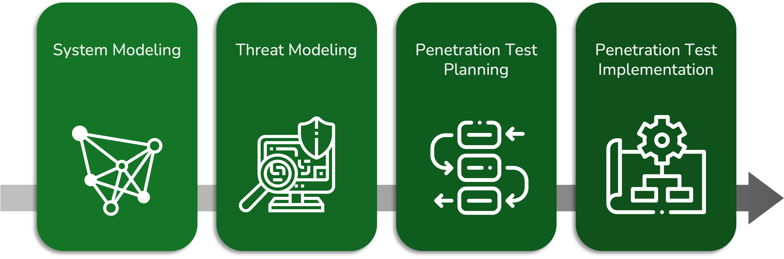
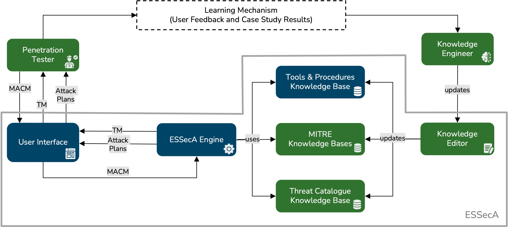

# Penetration Test Planner 🎯

This web app is designed to help penetration testers plan their tests. It provides a simple interface to create and manage penetration test projects. It is based on the ESSecA framework. 

## ESSecA: Expert System for Security Assessment

### Methodology
The [ESSecA](https://www.sciencedirect.com/science/article/pii/S0045790622000350?casa_token=wUCWFc85jBQAAAAA:64XFHfYDg9BA9os7H1gYSp99FRAW_4CmA6LqywCDZJ_OOCWKKsbbyd43jdAqWPg7WEGXbJ1c) (Expert System for Security Assessment) is methodology for security assessment.

It is based on the following steps:
1. **System Modeling**: Identify the system components and their relationships. The SuA (System under Analysis) is modeled as a graph, using a graph-based representation, called [MACM](https://link.springer.com/chapter/10.1007/978-3-319-57186-7_57) (Multi-purpose Application Composition Model).
2. **Threat Modeling**: Identify all the threats to which each *asset* of the SuA is exposed.
3. **Penetration Test Planning**: Plan the penetration test, identifying the assets to be tested and the penetration test techniques to be used.
4. **Penetration Test Implementation**: Implement the penetration test, using the techniques defined in the previous step.

### Framework
The methodology is supported by a framework. The framework is composed by the following components:
- **Knowledge Bases**: The knowledge bases are used to store the knowledge about the threats, the tools, and the penetration test plans. In particular, those are:
  - **Threat Knowledge Base**: Contains the knowledge about the threats.
  - **Tool Knowledge Base**: Contains the knowledge about the tools.
  - **CAPEC Knowledge Base**: Contains the knowledge about the CAPEC (Common Attack Pattern Enumeration and Classification) attacks.
- **Engine**: The engine is the core of the framework. Based on the knowledge stored in the knowledge bases and the system model, the engine is able to generate
  - The **Threat Model**: The threat model is a list of threats to which each asset of the SuA is exposed.
  - The **Penetration Test Plan**: The penetration test plan is a list of assets to be tested and the penetration test techniques to be used.
- **User Interface**: The user interface is used to interact with the engine. It allows the user to:
  - Load the system model.
  - Generate the threat model.
  - Generate the penetration test plan.
- **Knowledge Editor**: The knowledge editor is used to edit the knowledge stored in the knowledge bases.

### System Model
The system model is a graph-based representation of the SuA. The SuA is modeled as a graph, using the MACM (Multi-purpose Application Composition Model). The MACM is stored into a GDBMS (Graph Database Management System). In particular, it is stored into a [Neo4j](https://neo4j.com) database, queried using the [Cypher](https://neo4j.com/docs/cypher-manual/current/introduction/) query language. The system model is used as input for the engine.

## Penetration Testing

Penetration testing is a simulated cyber attack where professional ethical hackers break into corporate networks to find weaknesses before attackers do. Penetration testers use the same tools, techniques, and procedures that attackers do, but under controlled conditions to identify weaknesses in the organization's security posture.

# How to use the Penetration Test Planner

1. **Create a new System Model**: Using the Cypher query language, create a new system model in the form of a query that creates the nodes and relationships of the MACM.
2. **Load the System Model**: Load the system model in the Penetration Tests page.
3. Click the *View* button to view the plan.